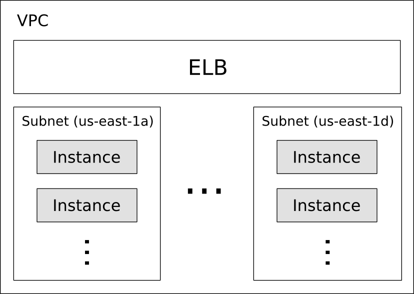

### Outline

* What is Terraform?
* Related technology
* Creating your first stack
  * VPC
  * Subnets
  * Instances
  * ELB
  * Demo deploy
* Tips and tricks
* Terraform at Shopify

----

### What is Terraform?

* {:.fragment} Infrastructure as code
* {:.fragment} Understands dependencies between resources
* {:.fragment} Group collections of resources together as a module
* {:.fragment} Expose information about stacks via outputs

Notes:

* Hashicorp working on cloud provisioning / orchestration
  * Consul, vault, packer, serf, nomad, atlas
* No more artisanal infrastructure
* Dependencies between resources ensures everything is brought up in correct order
* Modules encourage reusability
* Generated state files can be used as inputs to other stacks

----

### Related technology

* {:.fragment} CloudFormation
  * {:.fragment} AWS only
  * {:.fragment} Proprietary
* {:.fragment} Chef, Puppet, Ansible
  * {:.fragment} Mostly focused on config management and application orchestration
  * {:.fragment} Plugins for infrastructure

Notes:

* AWS only => Terraform is platform agnostic (Google, Docker, Dynect, Heroku, etc)
* Proprietary => cannot extend the language
* Config management => Terraform is infrastructure
* Plugins for infrastructure =>
  * Works, but not what these things are built for (cohesiveness)
  * What happens when I modify the infrastructure resource?

----

### Creating your first stack

1. {:.fragment} Setting up a VPC
2. {:.fragment} Adding subnets
3. {:.fragment} Adding instances
4. {:.fragment} Adding an ELB
5. {:.fragment} Deploy!

Notes:

* Describe what a VPC is
* Keeping things simple with public subnets
* Application deployment is not really what Terraform should be doing

----

### Creating your first stack



----

### Creating your first stack – Provider

```sh
provider "aws" {
  region = "us-east-1"
}
```

* `provider` blocks configure any of the supported resource providers
* `chef`, `google` (cloud), and many other providers come by default
* Some read in environment vars for config. For example, `AWS_ACCESS_KEY_ID`
  and `AWS_SECRET_ACCESS_KEY`

Notes:

* This is HCL (Hashicorp Config Language). Can also write in pure JSON
* Provider blocks often optional because they either have no config (e.g., template
  files) or read from env (e.g., aws)

----

### Creating your first stack – VPC

```sh
resource "aws_vpc" "main" {
  cidr_block = "10.0.0.0/24"
}

resource "aws_internet_gateway" "gw" {
  vpc_id = "${aws_vpc.main.id}"
}
```

* `${…}` is an interpolation
* Other resources referenced in an interpolation via `${type.name.attribute}`

Notes:

* Explain the CIDR notation (last 8 bits vary) 
* Internet gateways connect our VPCs to the public internet

----

### Creating your first stack – Subnets

```sh
variable "azs" {
  default = "b,c,d,e"
  description = "Availability zones to use for subnets"
}

resource "aws_subnet" "public" {
  count = 4
  vpc_id = "${aws_vpc.main.id}"
  map_public_ip_on_launch = true

  lifecycle {
    prevent_destroy = true
  }

  cidr_block = "${cidrsubnet(aws_vpc.main.cidr_block, 2, count.index)}"

  availability_zone = "us-east-1${element(split(",", var.azs), count.index)}"

  tags {
    Name = "Public Subnet"
  }
}
```

* Variables are inputs to your terraform stacks and modules
* `count` is a special attribute to support multiplicity of resources
* `lifecycle` is also a special attribute, here preventing the resource from being destroyed
  (terraform destroy, from changing a ForceNewResource attribute)
* Interpolations can use functions, like `cidrsubnet`

Notes:

* No such thing as a constant, so we make use of variables
* Many more attributes on resources, this is just a sample
* `prevent_destroy` needs to be removed or set to `false` before resource can be destroyed

----

### Creating your first stack – Route table

```sh
resource "aws_route_table" "public" {
  vpc_id = "${aws_vpc.main.id}"
}

resource "aws_route" "internet" {
  route_table_id = "${aws_route_table.public.id}"
  destination_cidr_block = "0.0.0.0/0"
  gateway_id = "${aws_internet_gateway.gw.id}"
}

resource "aws_route_table_association" "public" {
  count = 4
  subnet_id = "${element(aws_subnet.public.*.id, count.index)}"
  route_table_id = "${aws_route_table.public.id}"
}
```

* `resource.name.*.attr` is a splat, used when `count > 1`
* Routes can be specified in the route table itself, but using the `aws_route`
  resource simplifies future additions / removals

Notes:

* `0.0.0.0/0` is your default route
* Terraform doesn't manage inline routes / security group rules well, so we prefer
  using separate resources instead
* Can reference attributes of individual resource; use `count`, `lifecycle`, etc

----

### Creating your first stack – Instances

```sh
resource "aws_security_group_rule" "allow_all_ssh" {
  security_group_id = "${aws_vpc.main.default_security_group_id}"
  type = "ingress"
  from_port = 22
  to_port = 22
  protocol = "tcp"
  cidr_blocks = ["0.0.0.0/0"]
}

resource "aws_instance" "www" {
  count = "${var.num_instances}"
  ami = "${var.ami}"
  instance_type = "${var.instance_type}"
  subnet_id = "${element(aws_subnet.public.*.id, count.index)}"
  key_name = "${aws_key_pair.deploy.key_name}"
  user_data = "${file(concat(path.module, "/user_data.sh"))}"

  tags {
    Name = "web-server-${count.index}"
  }
}
```

* `element` wraps around the input list
* Allowing all SSH will simplify our deployment resource, which will connect
  directly to the instance via SSH
* We read in the userdata script with the `file` function, a script that will
  set up nginx

Notes:

* Wrapping is a good default, if we have more instances than subnets, for example
* VPN is an alternative to allowing all SSH
* from/to port values can differ to cover _all_ traffic (see documentation)

----

### Creating your first stack – ELB

```sh
resource "aws_elb" "www" {
  name = "www"
  instances = ["${aws_instance.www.*.id}"]
  subnets = ["${aws_subnet.public.*.id}"]
  cross_zone_load_balancing = true
  security_groups = [
    "${aws_vpc.main.default_security_group_id}",
    "${aws_security_group.allow_elb_http.id}",
  ]

  listener {
    instance_port = 80
    instance_protocol = "http"
    lb_port = 80
    lb_protocol = "http"
  }

  # health checks

  tags { Name = "www" }
}
```

* Some resources have "nested blocks" for configuration
* For `aws_elb`, we can have multiple `listener` and `health_check` blocks
* We still need square brackets around interpolations that produce lists so
  that we pass schema validation

Notes:

* See documentation for health check syntax
* `allow_http` security group allows ingress from all traffic on ports
  80/443 and all egress
* Note that instances will need allow traffic on port 80 for ELBs, but the
  default security group allows all traffic within a VPC. This traffic
  does not have to be open to the world, just the ELB

----

### Creating your first stack – Deploy

```sh
resource "null_resource" "deploy" {
  count = "${var.num_instances}"

  connection {
    user = "ec2-user"
    host = "${element(aws_instance.www.*.public_ip, count.index)}"
    agent = true
  }

  provisioner "remote-exec" {
    inline = [ "rm -rf ~/www && mkdir ~/www" ]
  }

  provisioner "file" {
    source = "${template_file.local_www_path.rendered}/"
    destination = "/home/ec2-user/www"
  }

  provisioner "remote-exec" {
    inline = [
      "sudo mv /home/ec2-user/html/* /usr/share/nginx/html",
      "sudo service nginx reload"
    ]
  }
}
```

* `local_www_path` exists solely to strip an optional trailing slash
* `connection` blocks specify how provisioners will connect to a resource
* Normally configured by the provider, but sometimes the defaults aren't sufficient
* Can be placed inside a provisioner for local configuration

Notes:

* Remember that `user` can vary based on AMI
* Provisioners executed in order
* Connections support private key auth, bastion hosts, and windows remote management

----

# Demo

Notes:

```sh
$ vim user_data.sh
$ vim terraform.tfvars
$ terraform plan --out=foo.plan
$ terraform show foo.plan
$ terraform apply foo.plan
$ open `terraform output endpoint`
```

If enough time, modify www/index.html, taint the deploy resources and apply again

----

### Tips and tricks

* {:.fragment}
  Variables are only strings (for now), so to support lists you can join on a delimiter
  when passing a value into a module and split within the module
* {:.fragment}
  No support for conditionals, but you _can_ use interpolations in certain ways to simulate them
  (e.g., ternary operations)
* {:.fragment}
  Never do a raw `terraform apply`, but rather output a plan file from `terraform plan` to use
* {:.fragment}
  State can be stored in many ways, but git is perhaps the simplest
* {:.fragment}
  Use vars files to switch between different environments (e.g., production, staging)

Notes:

* No easy way to pass mappings to modules, but can pass keys + values list and get a 1-level map
* `count = 0` will not make that resource
* If you use var files, the plan you see from `terraform plan` may be different from what
  gets applied with `terraform apply` (if you happen to forget to use the same var files)

----

### Terraform at Shopify

* {:.fragment} Manage a ~100 instance cluster of nodes (over-provisioned for flash sales)
* {:.fragment} Went from time to scale time taking ~1 hour to just a few minutes
* {:.fragment} DNS plugin for reading TXT records
* {:.fragment} Chef plugin for creating/delete chef nodes and clients
* {:.fragment} Wrapped Terraform binary to ensure best practices

Notes:

* DNS plugin is quite simple and a great example of extending the language
* DNS plugin isn't really doing CRUD resources, but just RU, because there
  are no other options right now. Hashicorp is working on this (data resources)
* Chef provider was recently added, so our plugin is no longer necessary
* Check out Shopify on GitHub to see these plugins

----

### More information

* Official documentation
  * <https://www.terraform.io/docs/index.html>
* Official repository
  * <https://github.com/hashicorp/terraform>
* Community modules
  * <https://github.com/terraform-community-modules>
* Shopify DNS provider
  * <https://github.com/Shopify/terraform-provider-dns>
* IRC: `#terraform-tool` on Freenode
