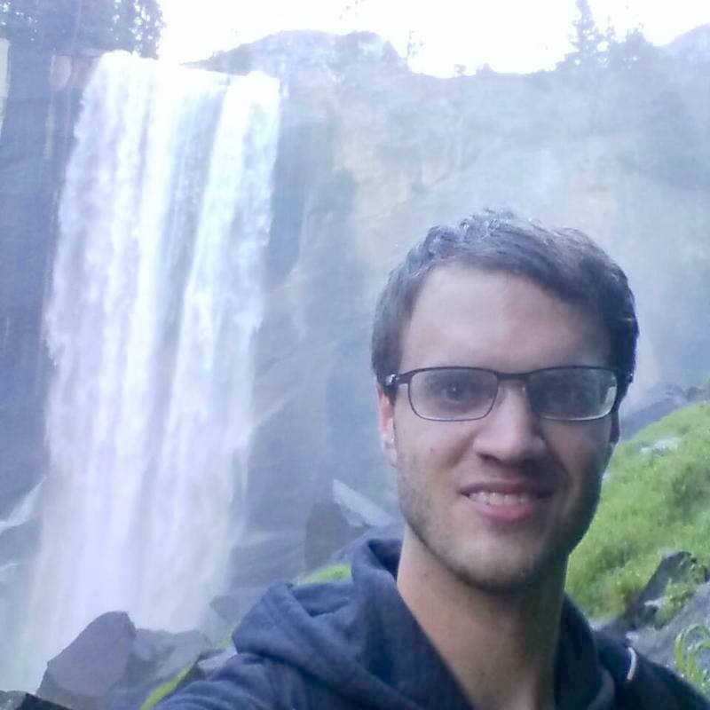

The name's __Jason Gedge__, but you've probably already figured that out.
I'm a __problem solver__, with software being my medium of choice. In other words,
I'm a __software developer__. I also enjoy _composing music_ and _playing guitar_.
I originally came from the far east of __Canada__, in the lovely province of
[Newfoundland and Labrador](http://en.wikipedia.org/wiki/Newfoundland_and_Labrador "Wikipedia Entry").
These days I'm living in the Bay Area of California, working for __YouTube__.

In 2011, I received my __Master of Science__ degree in Computing Science from
the University of Alberta. My research took me into the field of __computer
vision__, perhaps one of the fields of research I find most interesting. I also
enjoy dabbling in __computer graphics__, __image processing__, and
__computational photography__ (kind of a hybrid of all of the above).  In a
more general sense, I am a big fan of processing and/or producing visual data.

If you happen to be interested in me and/or what I do, be sure to check me out on
[GitHub](http://www.github.com/thegedge/ "My GitHub Account"), or perhaps even some of
my [Tweeting](http://www.twitter.com/thegedge/ "My Twitter Account").
